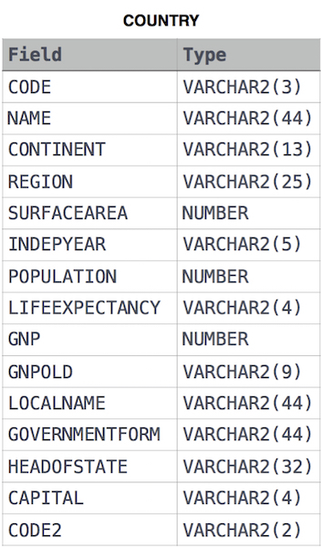

## African Cities

Given the CITY and COUNTRY tables, query the names of all cities where the CONTINENT is 'Africa'.

Note: `CITY.CountryCode` and `COUNTRY.Code` are matching key columns.

Input Format

The CITY and COUNTRY tables are described as follows:




****

### Answer

**SQL Query**

```sql
SELECT CITY.NAME FROM CITY JOIN COUNTRY ON 
CITY.COUNTRYCODE=COUNTRY.CODE WHERE COUNTRY.CONTINENT='Africa';
```
